If you're like me, then you've tried to log into a website and got confused with which button to click. The placement, terminology and styling often throws me off. For authentication we often see `log in`, `sign in` and for registration words like `sign up` or `create account`.

In this case study, I want to determine which terminology should be used as default for authentication and registration buttons.
Then, identity common patterns of placement for these buttons when viewed on a personal computer (monitor) not a mobile device.
We will look at 10 common social media websites and 10 web developer websites and see what they do.

### Social Media Sites
| Url           | Auth            | Registration             | Placement                                              |
|---------------|-----------------|--------------------------|--------------------------------------------------------|
| facebook.com  | Log In          | Create New Account       | Landing page right                                     |
| twitter.com   | Sign In         | Sign Up With ...         | Landing page right                                     |
| linkedin.com  | Sign in         | Join Now                 | Landing page left; Nav top right                       |
| youtube.com   | SIGN IN         | Create Account           | Nav top right; Registration is hidden behind Auth form |
| pinterest.com | Log in          | Sign up                  | Nav top right                                          |
| instagram.com | Log In          | Sign up                  | Landing page right                                     |
| tumblr.com    | Log in / Log In | Sign up                  | Landing page center; Nav top right                     |
| twitch.tv     | Log In          | Sign Up                  | Nav top right                                          |
| flickr.com    | Log In          | Sign Up / Start for free | Nav top right                                          |
| reddit.com    | Log In          | Sign Up                  | Nav top right                                          |

### Developer Sites
| Url                   | Auth       | Registration                      | Placement     |
|-----------------------|------------|-----------------------------------|---------------|
| github.com            | Sign in    | Sign up                           | Nav top right |
| about.gitlab.com      | Login      | Get free trial                    | Nav top right |
| developers.google.com | Sign in    | n/a                               | Nav top right |
| aws.amazon.com        | My Account | Create an AWS Account             | Nav top right |
| azure.microsoft.com   | Sign in    | Free account / Try Azure for free | Nav top right |
| cloudflare.com        | Log In     | Sign Up                           | Nav top right |
| digitalocean.com      | Log In     | Sign Up                           | Nav top right |
| godaddy.com           | Sign In    | n/a                               | Nav top right |
| npmjs.com             | Sign In    | Sign Up                           | Nav top right |
| codepen.io            | Log In     | Sign Up                           | Nav top right |

## Conclusion

### Authentication
* `Log in` or variations - 11
* `Sign in` or variations - 8

### Registration
* `Sign up` or variation - 12
* `Create ...` or similar - 3
* remaining terms are all unique

It appears that the results for authentication lean slightly towards `Log in` while `Sign in` is a very close second option.
For registration, `Sign up` is the clear winner. Other options vary, but `Create ...` seems to be the next most viable.

If `Sign up` is chosen for registration, then it would be logical to avoid `Sign in` as those can easily be confused.
Although styling the buttons differently may help distinguish `Sign in` & `Sign up` only differ by one letter so it is easy to mistake.

As for registration, most occurences of `Create ...`  happen when the action is displayed in the Landing page, and not the nav.
Since the nav often contains many items, `Create ...` may take up too much horizontal space. Having succinct terms for the nav would reduce visual clutter.

### Rules
* use `Sign Up` for registration by default.
* use `Log In` for authentication by default.
* accent the registration button `Sign Up` with a border or background color.
* `Create Account` or variation is permitted for registration if there is enough horizontal space. Preferrably on a landing page form.
* `Sign In` is only permitted for authentication if `Sign Up` is not used for registration.

## Screenshots
### Facebook
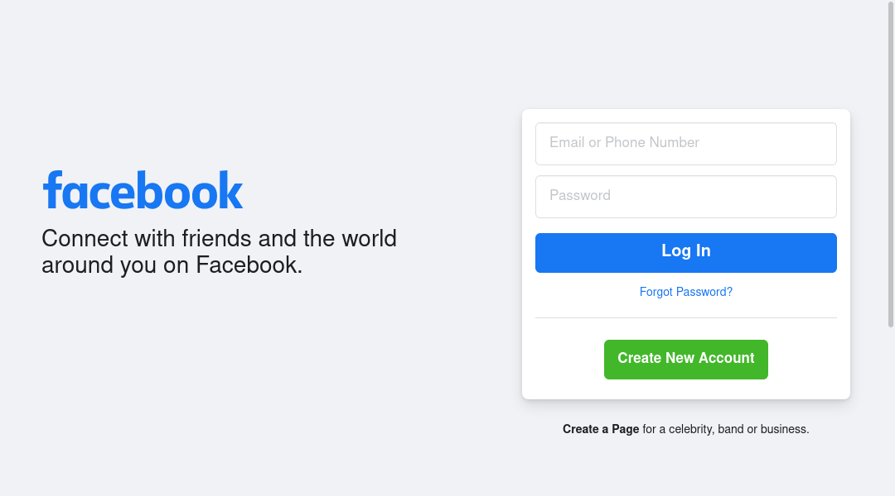
### Twitter

### LinkedIn

### Youtube

### Pinterest

### Instagram
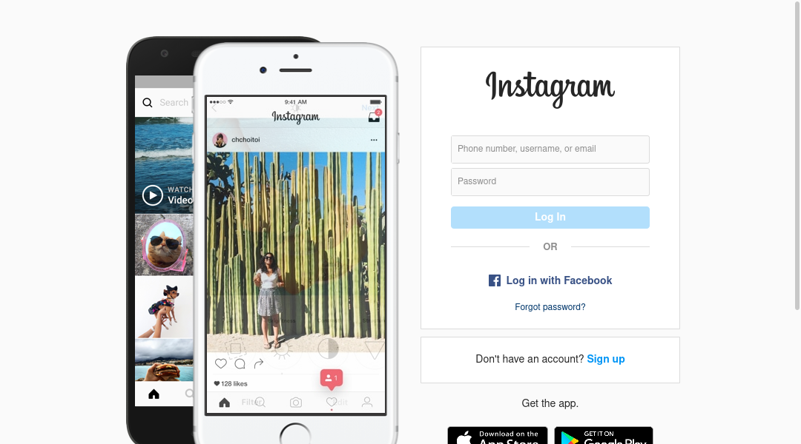
### Tumblr
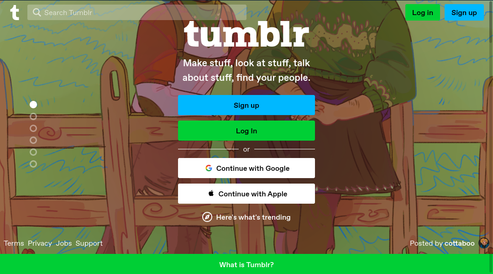
### Twitch
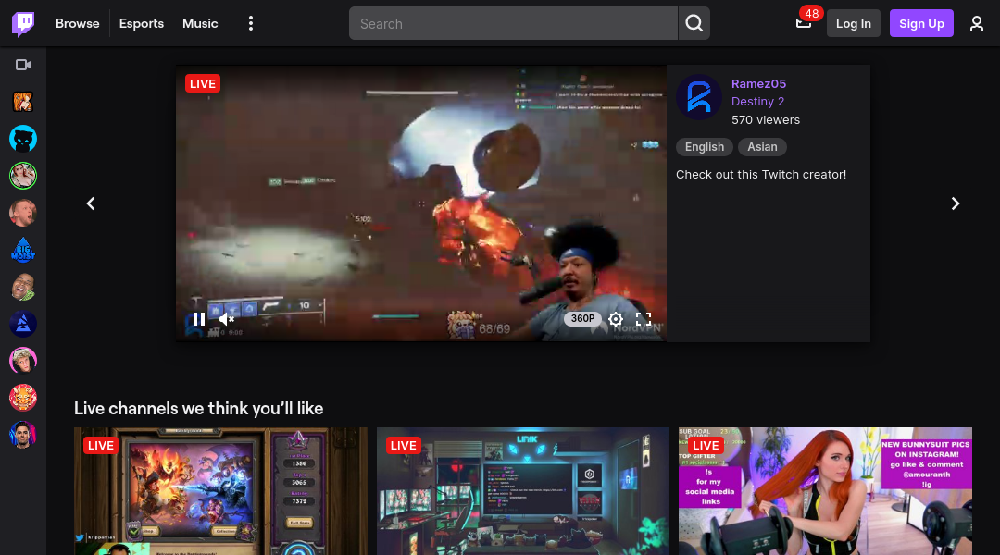
### Flickr
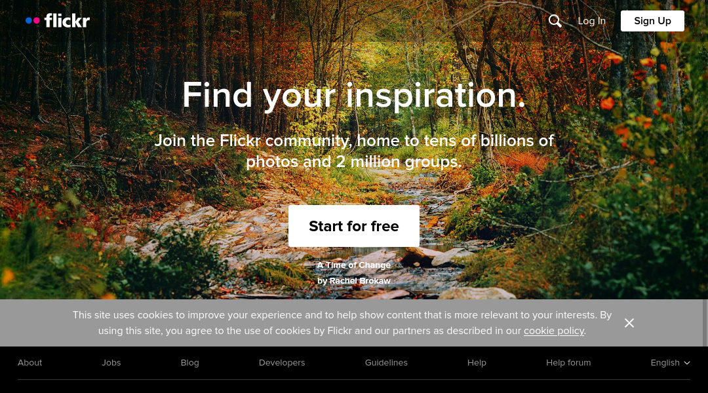
### Reddit
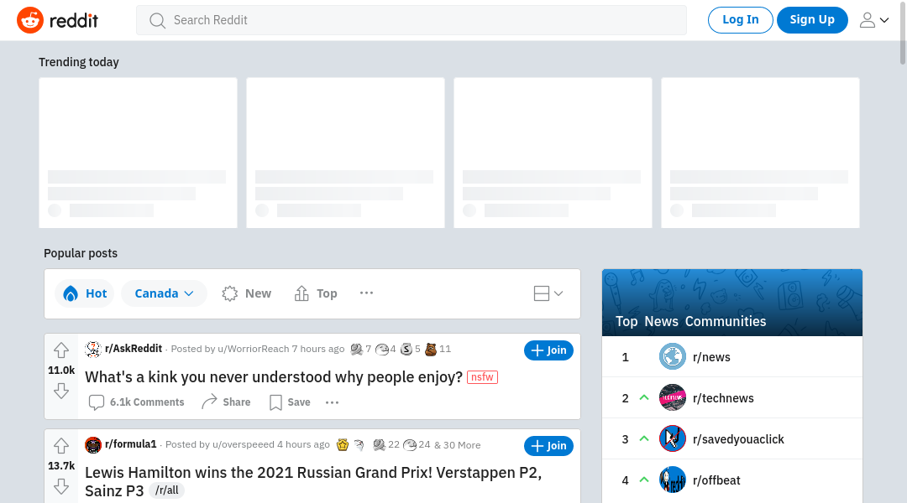

## Developer Sites
### Github github.com
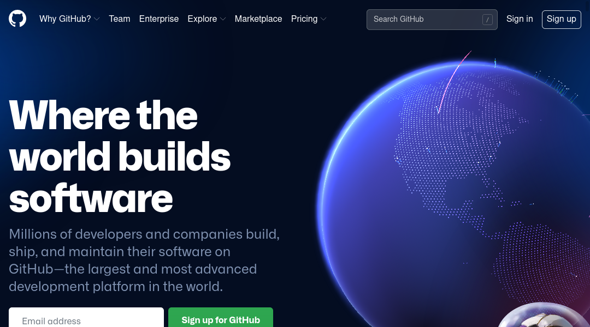
### Gitlab about.gitlab.com

### Google Developers developers.google.com
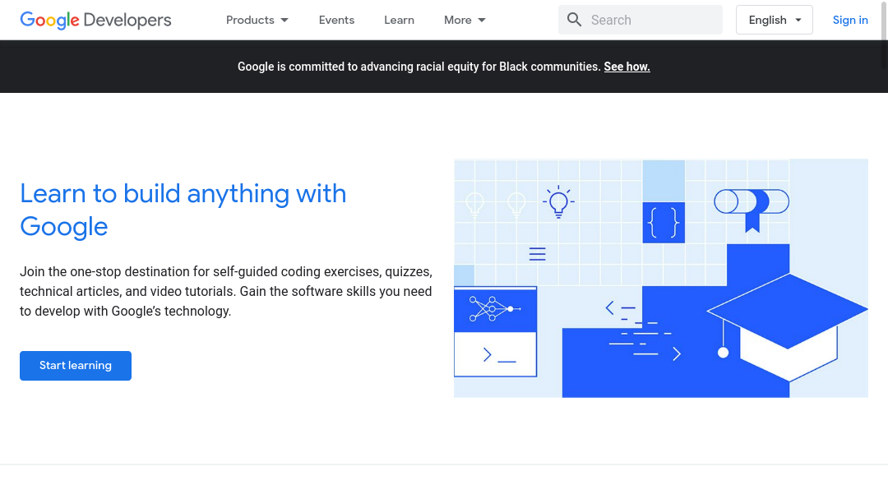
### Amazon Web Services (AWS) aws.amazon.com

### Microsoft Azure azure.microsoft.com
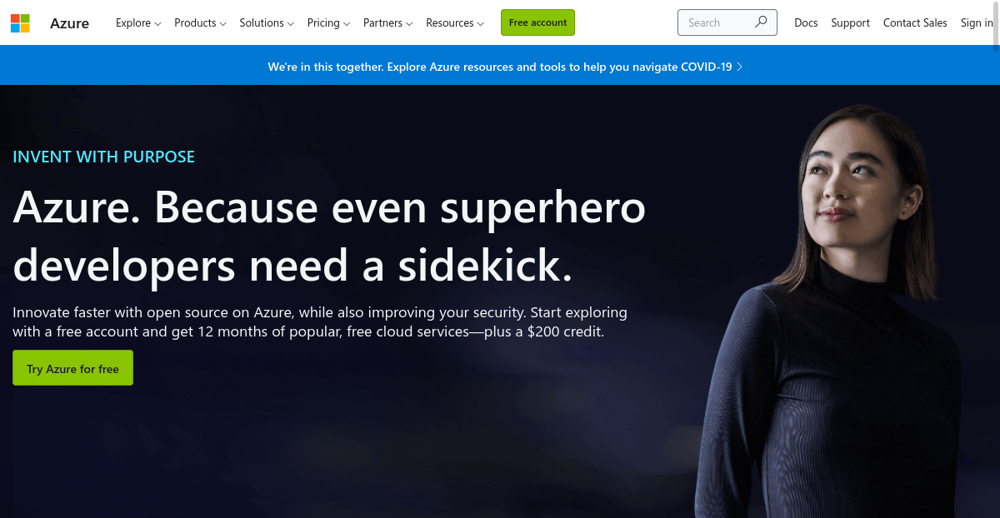
### Cloudflare cloudflare.com
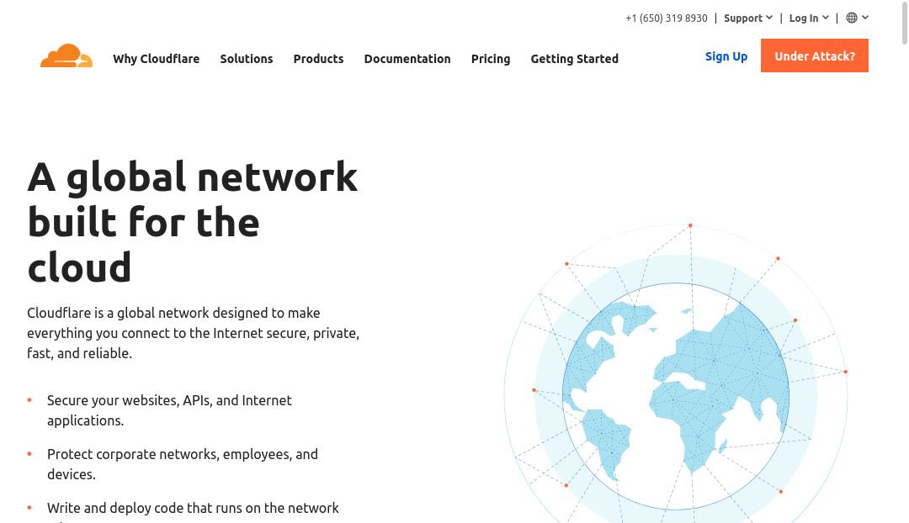
### Digital Ocean digitalocean.com

### Go Daddy godaddy.com
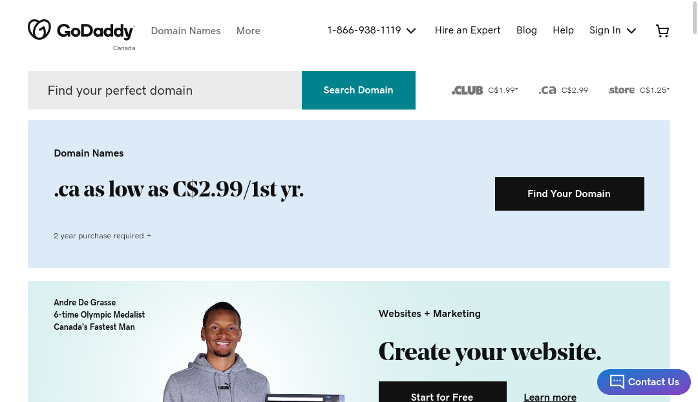
### NPM npmjs.com
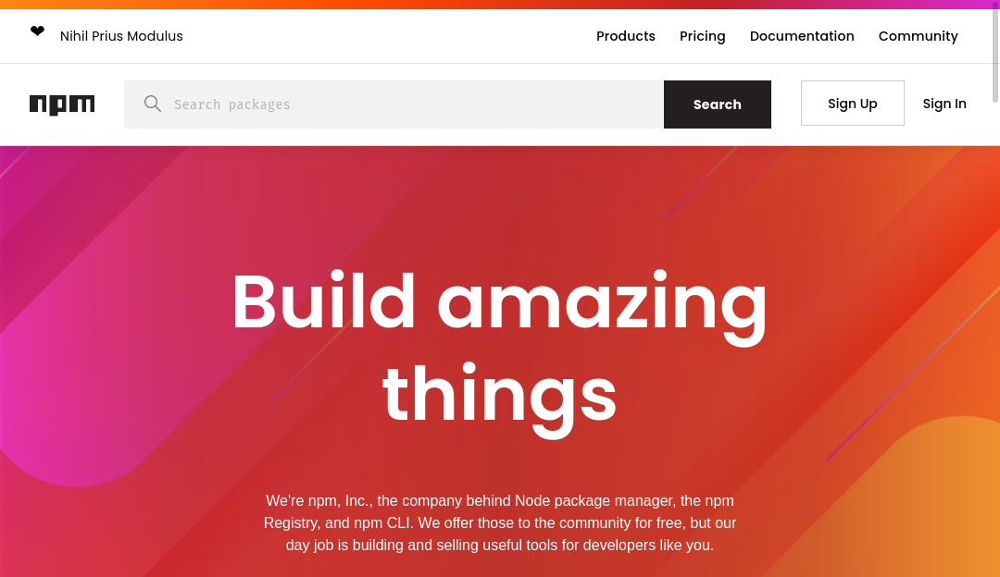
### Codepen codepen.io
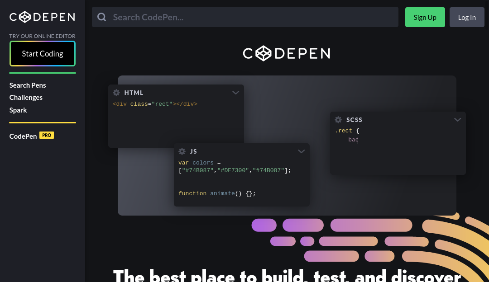