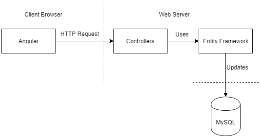
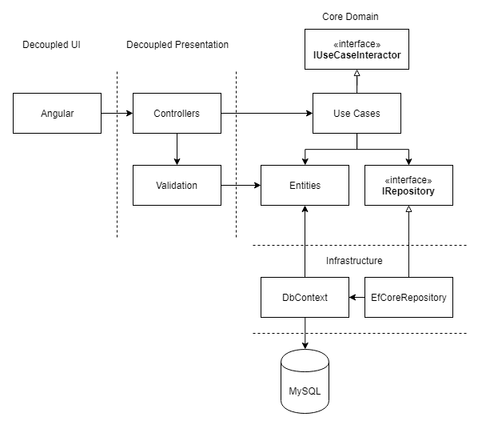

Recently, I've been working on a personal web development project using Angular
and .NET Core. The architecture of the .NET Core portion was fairly simple, with
controllers calling the Entity Framework context to do CRUD operations on the
database. When it came time to add authentication to the application things
started to get messy; I like being clean. I wanted to find a way to add Identity
Framework to the project so that it was possible to change in the future, that's
when my search led me to the Clean Architecture Pattern by 'Uncle Bob' (He's
everyone's uncle?).

Out of all the concepts, patterns and principles in the book I want to implement
these into my application: Tymish.

- Project should scream 'Time Sheet Application'
- Core domain should be decoupled from the&nbsp;**user interface**
- Core domain should be decoupled from any **frameworks**
- Core domain should be decoupled from any&nbsp;**data persistence**

#### My Current API architecture

##### The original layout of the application when first developed.

##### Clean Architecture Concept Version 1

Seems straight forward but not 100% sure on how this will turn out. I can
already see there's going to be a few challenges so I'll write about them and
their solutions as I refactor the code.

Code is hosted on Github [here](https://github.com/tymish).
