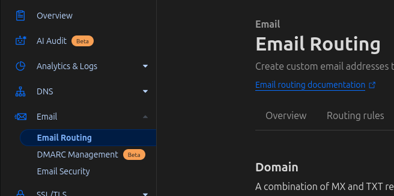
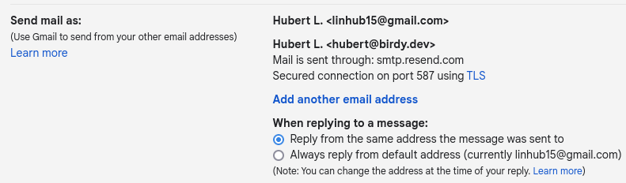
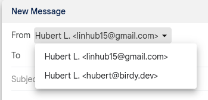

Remember when email addresses looks like `xXcooldude33Xx@hotmail.com`? Or maybe
you have a more professional one like `jane.doe@gmail.com`. When I made my first
email address I didn't think too much about it, but when you're older, having a
simple email address looks more professional. Even more professional is an email
with your own domain. `jane.doe@<your-domain>.com`.

Today you can get branded emails from most domain registrars either for free or
for a small fee, but if you want the integration and convenience of gmail,
you'll have to pay monthly.

Let me show you how to set this up for free. You'll need a gmail account, domain
name, and a [Resend](https://resend.com) account.

> [!NOTE]
> At the time of writing, the limits for Resend are 100 emails per day and 3000
> per month. I've never sent that many emails in a day, but depending on your
> needs you may choose a different SMTP provider.

## Receiving emails to your domain

Some domain registrars have email forwarding built-in. If it does I suggest
using it.

For myself, I use Cloudflare's email routing to forward my emails since I also
use them to manage my DNS. If your domain registrar doesn't offer email
forwarding then we can set this up for free with Cloudflare.

### Using Cloudflare email routing

You'll need a [Cloudflare](https://www.cloudflare.com) account, and your gmail
address for this part.

1. Add a domain in Cloudflare.
2. Copy the nameserver information into your domain registrar. They look
   something like `NS *.ns.cloudflare.com`.

Now your domain's DNS is managed by Cloudflare, so we can setup Email routing.

1. Select your domain and go to `Email > Email Routing` section in Cloudflare.
   
2. Hit the "Get Started" button and follow the steps to setup your destination
   email address.

By the end of this step you will have added 4 DNS records to your domain, which
allows Cloudflare to forward emails to your gmail address.

> [!NOTE]
>
> I like to add the comment `cloudflare: email routing` to the DNS records so
> future me knows why the record exists. Especially since the `TXT` record is
> not locked.

### Check if you can receive emails.

Your domain should now be setup to receive emails. Send yourself an email from
another account or ask someone to send you an email and check that it works.

## Send emails with your custom domain

Next, let's send emails with our domains. To do this we have to go into gmail
and configure a sending alias with an smtp server (they no longer let you send
on behalf of a domain from their server).

1. Go to `https://mail.google.com`
2. Click the gear on the top right and select `See all settings`.
3. Under the `Accounts and Import` tab, there is a section called
   `Send mail as`. 
4. Clicking `Add another email address` and follow the steps.

### Form: Enter information about your other email address

- `Name`: recipient will see this in their inbox
- `Email address`: use the same one setup for receving emails
- `Treat as an alias`: keep it checked unless you are sending on behalf of
  someone else

### Form: Send mail through your SMTP server

For this form we need to have an SMTP server. We'll use
[Resend](https://resend.com) for the example, but you could use AWS SES.

> [!NOTE]
>
> #### Configuring Resend SMTP
>
> 1. Go to `https://resend.com/domains` and your domain.
> 2. Take the DNS records and add them to your DNS provider. In this guide we're
>    using Cloudflare, so we can copy the four DNS records into Cloudflare DNS.
> 3. Hit the verify button.
>
> #### Create an API key
>
> 1. Navigate to the the API Keys `https://resend.com/api-keys`
> 2. `Create API Key` with a name like `gmail_send`, limit the permissions to
>    sending only, and also limit the domain (if you're in a pro plan)
> 3. Keep this window open or save the key somewhere temporarily (clipboard or
>    text editor).

Okay, back to the form. Fill it out with this info and submit.

| Field                        | Value              |
| ---------------------------- | ------------------ |
| SMTP Server                  | smtp.resend.com    |
| Port                         | 587                |
| Username                     | resend             |
| Password                     | `<RESEND API KEY>` |
| Secured connection using TLS | `true`             |

### Try to send an email

We're done! Let's test. Send someone an email from your domain. When composing
an email, you'll see a select option for your new email.

## Final notes

Although you can send and receive emails with that domain, Google apps like
Calendar, YouTube, and Drive will still be connected to your gmail account. If
you want to have a dedicated email account for those, you'll need to pay for
[Google workspace](https://workspace.google.com/individual/).

If you found this helpful, follow me on
[LinkedIn](https://www.linkedin.com/in/linhub/) for notifications on future
posts.
